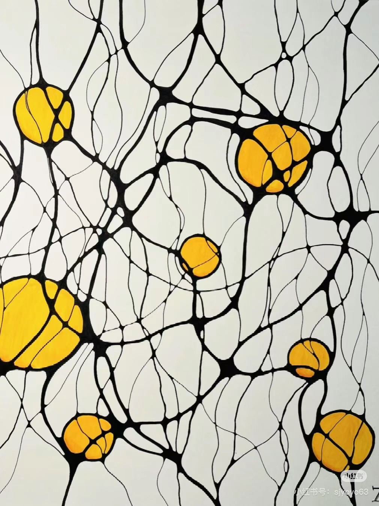
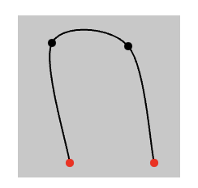
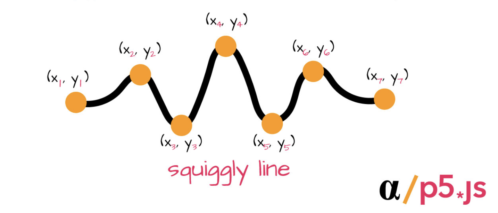

# xuxu0804_9103_week8

## Part 1: Imaging Technique Inspiration

### This picture is by Austrian artist Sigrid A., who focuses on exploring the interaction of shapes, lines and colours. This work shows the contrast between yellow circles and organic black lines. These elements can be simulated through code, with circles as network connections between nodes.

### The reference work 'Wheels of Fortune' in the major project, in addition to the basic circular wheel, has another difficulty: how to restore the circular nodes connected by lines around the circular wheel. Therefore, p5.js can be used to be suitable for expressing dynamic connection relationships. This part of the effect can be achieved through beginShape() and endShape() combined with ellipse(), and curveVertex().

## Part 2: Coding Technique Exploration

### In p5.js, beginShape() and endShape() can define the start and end of the shape. At the same time, ellipse() is used to generate circular nodes.
### Draw curved lines by using curveVertex(), which is suitable for representing curved lines between nodes in an image.

### General steps:
### 1. Set up the background.
### 2. Use the ellipse() function to draw circular nodes at appropriate locations.
### 3. Use beginShape() and endShape() to wrap curveVertex() to draw smooth organic curves, representing the lines connecting each circular node.
### 4. Set the line through the stroke() and stroke weight (), and use fill() to set the fill colour of the node.

### Links to example implementations:

[curveVertex()](https://p5js.org/reference/p5/curveVertex)

[How to Draw a Squiggly Line in P5JS](https://www.alpharithms.com/how-to-draw-a-squiggly-line-in-p5js-or-processing-120715)

